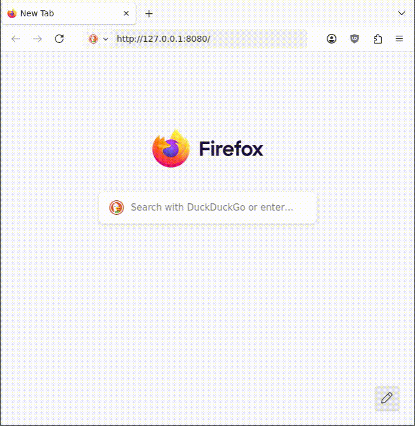

# misorepos

List gitlab repositories, using Miso.



## setup

- install Nix Flakes

- install Cachix

- use miso's cachix:

```sh
cachix use haskell-miso-cachix
```

## build and run (wasm)

```
nix develop .#wasm
make build && make serve
```

## build and run (docker)

```
nix develop .#wasm --command bash -c "make"
nix-build docker.nix
docker load < result
docker run --rm -it -p 3000:3000 misorepos:latest
```

## edit with vscode

```
nix-shell
code .
```

